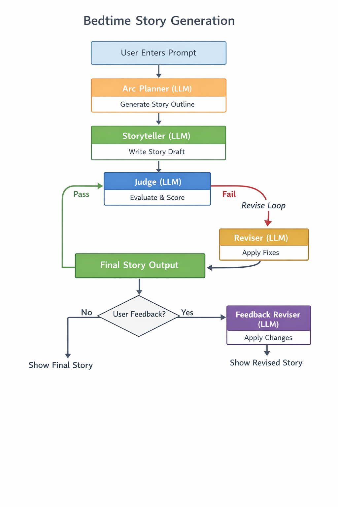

# Bedtime Story Generator (Hippocratic AI Take-Home)

This project is a Python script that generates safe, age-appropriate bedtime stories for children ages **5–10** using a structured prompting pipeline and an LLM judge.

The system emphasizes **story structure**, **safety**, and **iterative improvement**, while remaining simple and easy to explain.

---

## Overview

Given a short user prompt (for example, *“A story about a bunny and a kitten”*), the system:

* Plans a simple story arc  
* Writes a bedtime story following that arc  
* Uses an LLM judge to evaluate quality and safety  
* Revises the story if needed  
* Optionally applies user feedback  

All model calls use **gpt-3.5-turbo**, as required.

---

## Key Features

### Story Arcs

Before writing the story, the system creates a **6-beat arc**:

* Hook  
* Small problem  
* Attempt 1  
* Attempt 2  
* Gentle climax  
* Warm bedtime ending  

This improves pacing and ensures a calm, age-appropriate narrative.

---

### LLM Judge

A separate LLM call evaluates the story using a rubric:

* Age appropriateness  
* Bedtime coziness  
* Story arc clarity  
* Language simplicity  
* Creativity  
* Safety  

If the story fails, the judge returns **concrete fixes**, which are applied in a bounded revision loop.

---

### User Feedback Loop

After the final story is printed, the user can request changes such as:

* “shorter”  
* “funnier”  
* “more magical”  
* “different ending”  

The system applies this feedback in one additional revision pass.

---

## System Flow (High Level)

* **User** enters a story request  
* **Arc Planner (LLM)** generates a 6-beat story outline  
* **Storyteller (LLM)** writes the story following the arc and safety constraints  
* **Judge (LLM)** evaluates the story and returns pass/fail with fixes  
* **Reviser (LLM)** applies fixes if needed (bounded loop)  
* **Final story** is printed  
* **Optional feedback** triggers one more revision  

---

## Running the Code

### Requirements

* Python 3.9+  
* OpenAI Python SDK (`openai==0.28.x`)  
* An OpenAI API key set as an environment variable  

### Set your API key (Windows PowerShell)

```powershell
setx OPENAI_API_KEY "your_api_key_here"

pip install openai==0.28.1

python storyteller.py
```




